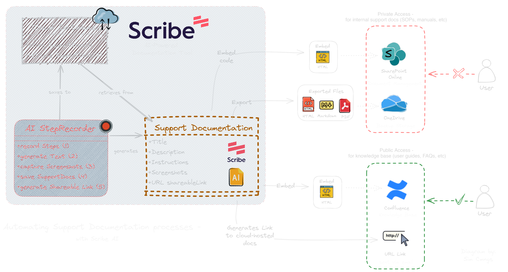
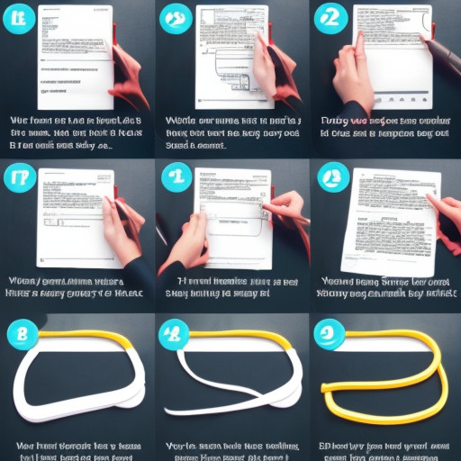
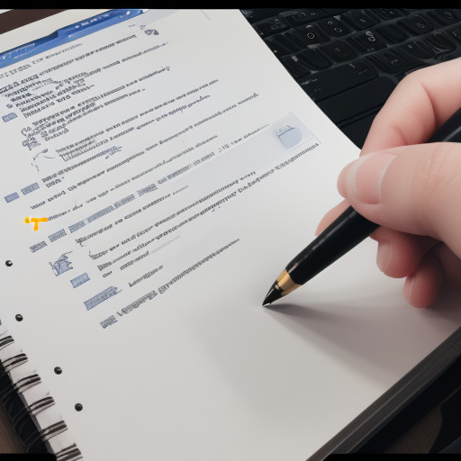
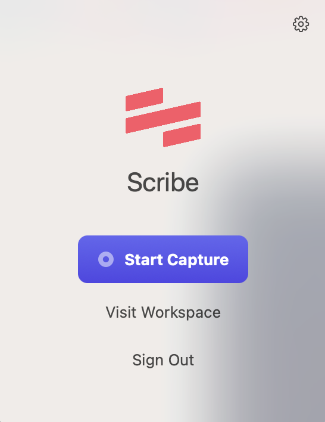
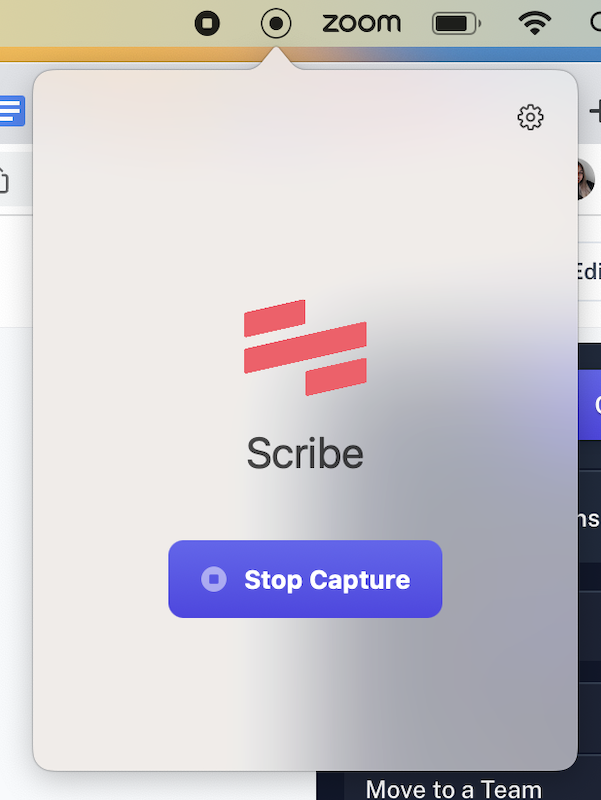
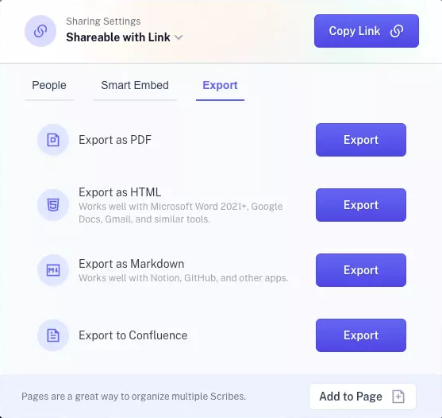
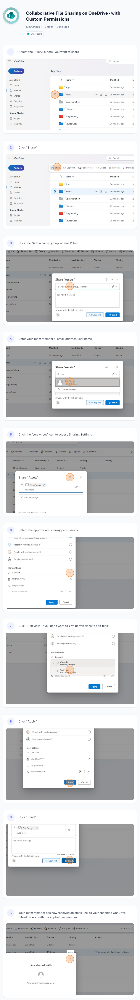

# Automating Support Document Creation with AI

This project aims to automate the process of creating support documentation, using an **AI cloud-hosted** *Step Recorder* and *Documentation Builder*.

> This project was originally made, to quickly develop visual support guides for non-technical users, struggling with text-only instructions.
> 
> The project has since been adapted to function within a hypothetical IT support environment, integrating with **Microsoft 365** for use with *SharePoint Online* and *OneDrive*.

## 🛠 Tools & Technologies:

- **System:** `Windows 11`
- **Cloud Platform:** `Microsoft 365`
- **Document Management:** `SharePoint` Online, `Confluence`
- **Collaboration:** `OneDrive` for Business
- **Documentation:** `AI-Step Recorder` *(Scribe)*
- **Ticketing:** `Jira` Service Management

---

# Introduction

The IT department's current system for creating support documentation, has led to several challenges for both our customers and support team members:

**1. The Creation Process** - <ins>labour-intesive and time-consuming</ins> 

> Manually creating support docs is a tedious process, involving multiple steps. From capturing screenshots, to adding annotations, to writing instructions, and arranging everything to create a visaully cohesive and professional-looking user guide.
>
> This <ins>long process</ins>, led to the Support Team <ins>prioritizing only common support tickets for documentation</ins>, leaving many users without visual support guides for self-troubleshooting.

**2. Content Quality** - <ins>non user-friendly experience</ins>  

> Most of the support docs are written as step-by-step instructions, saved as response templates in our ticketing system. But non-technical users often struggled with these text-only user guides.
>
> The <ins>lack of visual-aids</ins>  to help provide context, led to users being confused and making errors during the process of following these step instructions.

**3. Version Control** - <ins>lack of document maintenance</ins> 

> Keeping PDF support documentation up-to-date became difficult due to its static format, especially for applications that undergo frequent system updates and changes to their User Interface (GUI), requiring user guides to be re-created from scratch.
>
> This resulted in <ins>outdated instructions</ins> that weren't matching the users' screens, leaving them unable to resolve issues independently.

  

## ⛔ Problem Statement:
The problems ranged from:

- ❌ Time-consuming, manual creation of support documentation 
- ❌ Lack of visual guidance, limiting the ability to follow instructions effectively
- ❌ Difficulty in keeping PDF documentation up-to-date

## 💡 Solution:
After doing some research, I chose to implement `Scribe`, an AI-powered tool that automates the documenation process, by analysing recorded actions and generating professionally structured user guides.

`Scribe` was able to address each of the identified problem statements and offered the following key features:
- ✅ AI-Generated step instructions and formatting
  - *(speeding up the creation process for support docs)*
- ✅ Automated capturing and annotation of screenshots
  - *(providing visual guidance to accompany text instructions)*
- ✅ Cloud-hosted support docs, in HTML format
  - *(allowing for real-time updates & changes to documentation)*
 
 

---

# 💻 Implementation:

### 1️⃣ Installation:

#### <ins>**Setup Scribe**</ins>

- Created accounts for team members and installed Scribe's AI Step Recorders, on to desktop workstations and as browser extensions.

#### <ins>**Manage Access Permissions**</ins>

- Assigned access permissions for each team member's account.

  - **Team Admin** - for Admins/Managers to adjust user access and configure settings
  - **Creator** - for Support Engineers to create, edit and delete support docs
  - **Viewer** - for End Users/Clients to reference support docs for training or troubleshooting

#### <ins>**Company Branding**</ins>

- Developed support document templates, with logos and custom hex codes to match the company's branding.

---

### 2️⃣ Migration:

- Identified high-priority articles for migration.

- Then converted exisiting PDF/Word files into Scribe-generated support docs, using the `AI Step Recorder` to screen record action steps and processes.

---

### 3️⃣ Integration:

Integration with `Microsoft 365` / Cloud services:

#### <ins>**SharePoint Online**</ins>

> Embedded Scribe docs as **HTML code** to the <ins>Communication Site</ins>, for hosting internal support documentation such as SOPs, training manuals and troubleshooting guides.
> 
> *(For private access - restricted to IT Support team members only)* 

#### <ins>**Confluence**</ins>

> Embedded Scribe docs as **HTML code** to the <ins>Knowledge Base</ins> page, for hosting public-facing users guides and FAQs.
> 
> *(For public access - customers, end-users and clients)*

#### <ins>**OneDrive for Business**</ins>

> Exported Scribe docs to **HTML**, **Markdown** and **PDF** files.
> 
> Uploaded to OneDrive's <ins>cloud storage</ins> service to serve as backup copies, and to host on different platforms.

`Scribe`

USER GUIDE: Collaborative File Sharing on OneDrive - with Custom Permissions

> This support guide was created, to help a user share their project files and colloborate with Team Members on `OneDrive` for Business.
> 
> Details the process of:
> - Assigning file permissions, such as (View Only, Can Edit, Set Password).
> - Generating and sending a URL link to Team Members.

---

## 📊 Results:
The updated process for creating support documentation with **AI-Scribe**, achieved the following results:
- 📚 **Optimized Documentation Process**
>    - (AI-generated user guides, will automate the enitre process, <ins>eliminating the need to manually take screenshots</ins>, edit them, <ins>and add step instructions</ins>).
    
- 📉 **Reduced Support Ticket Volume**
>    - (Integration of visual-aids, will provide a more intuitive understanding of instructions, <ins>empowering users to resolve issues for themsleves</ins>).
    
- 😊 **Improved User Satisfaction**
>    - (Cloud-hosted support docs, will enable automatic updates, giving users access to the most accurate information, resulting in <ins>fewer errors during troubleshooting.</ins>).

---

## 🎉 Conclusion:
Automating support docs with AI-powered Scribe resulted in a streamlined documentation process, enhanced user experience, and improved version control.

---
